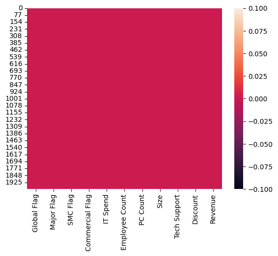
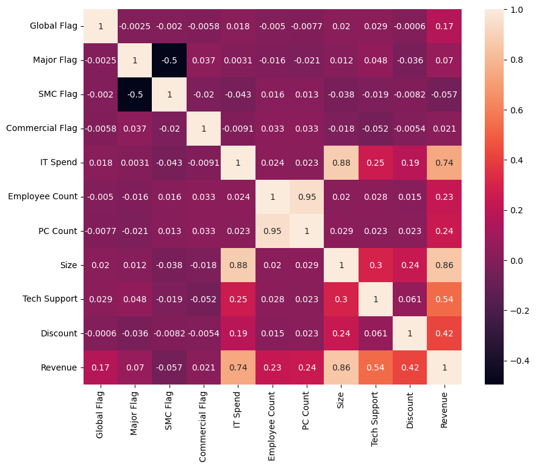

<a href="https://s.id/standwithpalestine"></a>

# Laporan Proyek Machine Learning

<table>
<tr>
<td>Nama</td>
<td>:</td>
<td>Suluh Sulistiawan</td>
</tr>
<tr>
<td>NIM</td>
<td>:</td>
<td>211351143</td>
</tr>
<tr>
<td>Kelas</td>
<td>:</td>
<td>Informatika Malam B</td>
</tr>
</table>

## Domain Proyek

Proyek ini berfokus pada analisis dampak berbagai faktor yang mempengaruhi pendapatan perangkat lunak dalam konteks penjualan perangkat lunak oleh sebuah startup. Dalam usaha untuk memahami sejauh mana inisiatif peningkatan, seperti pemberian insentif kepada pelanggan dan karakteristik pelanggan itu sendiri, dapat meningkatkan pendapatan, proyek ini akan menggunakan regresi linear sebagai alat analisis utama.

Dengan demikian, tujuan proyek ini adalah untuk mengidentifikasi variabel-variabel yang signifikan dalam mempengaruhi pendapatan perangkat lunak, serta mengukur hubungan linier antara variabel-variabel ini dan hasilnya. Analisis ini dapat memberikan wawasan yang berharga bagi startup dalam mengoptimalkan strategi penjualan dan investasi mereka berdasarkan karakteristik pelanggan dan insentif yang diberikan.

## Business Understanding

Pada tahap awal, saya harus memahami bahwa startup perangkat lunak ingin meningkatkan pemahaman mereka tentang dampak berbagai faktor terhadap pendapatan perangkat lunak. Ini melibatkan identifikasi dan klarifikasi masalah utama yang ingin dipecahkan. Pihak startup perlu memahami apakah inisiatif peningkatan mereka efektif dalam menggaet pelanggan baru atau meningkatkan penggunaan perangkat lunak oleh pelanggan yang sudah ada.

### Problem Statements

1. Bagaimana saya dapat mengukur dampak dari berbagai insentif yang diberikan kepada pelanggan terhadap pendapatan perangkat lunak?
2. Apakah karakteristik pelanggan, seperti ukuran, industri, atau tingkat dukungan teknis yang diterima, berpengaruh signifikan terhadap pendapatan?

### Goals

1. Mengidentifikasi faktor-faktor yang memiliki dampak signifikan pada pendapatan perangkat lunak.
2. Mengukur hubungan linier antara variabel-variabel tertentu, seperti insentif, karakteristik pelanggan, dan pendapatan perangkat lunak.

### Solution statements

- Mengimplementasikan analisis regresi linear untuk mengukur dampak berbagai faktor, termasuk insentif yang diberikan kepada pelanggan, serta karakteristik pelanggan (seperti ukuran, industri, dan dukungan teknis), terhadap pendapatan perangkat lunak.
- Melakukan eksplorasi metode analisis lainnya, seperti regresi logistik atau decision tree, untuk membandingkan hasil dan memperoleh wawasan tambahan mengenai faktor-faktor yang mempengaruhi pendapatan perangkat lunak.
- Mengoptimalkan model dengan teknik hyperparameter tuning dan cross-validation untuk meningkatkan prediksi pendapatan dan akurasi analisis.
- Memperkenalkan metrik evaluasi yang sesuai, seperti R-squared, Mean Absolute Error (MAE), atau akurasi klasifikasi (jika diperlukan), untuk mengukur kualitas prediksi dan evaluasi dampak faktor-faktor yang ada terhadap pendapatan perangkat lunak.

## Data Understanding

Dataset "Software Usage Promotion Campaign Uplift Modeling" yang tersedia di Kaggle adalah koleksi data yang digunakan untuk melakukan analisis mengenai dampak kampanye promosi perangkat lunak terhadap penggunaan produk oleh pelanggan. Dataset ini mencakup informasi tentang lebih dari 2.000 pelanggan, termasuk karakteristik pelanggan seperti ukuran perusahaan, industri, belanja TI, jumlah karyawan, dan jumlah PC yang digunakan.

Selain itu, dataset ini juga mencatat informasi mengenai insentif yang diberikan kepada pelanggan, seperti dukungan teknis dan diskon, serta jumlah pendapatan yang dihasilkan dari penjualan perangkat lunak dalam setahun setelah kampanye promosi diluncurkan. Dataset ini menjadi sumber data yang berharga bagi para analis dan peneliti untuk mengidentifikasi faktor-faktor yang berpengaruh dalam meningkatkan penggunaan produk perangkat lunak dan memahami dampak berbagai insentif pada hasil penjualan.

[Software Usage Promotion Campaign Uplift Modeling](https://www.kaggle.com/datasets/hwwang98/software-usage-promotion-campaign-uplift-model).

### Variabel-variabel

- **Global Flag**: Apakah pelanggan memiliki kantor global (1 untuk ya, 0 untuk tidak).
- **Major Flag**: Apakah pelanggan merupakan konsumen besar di industri mereka (1 untuk ya, 0 untuk tidak).
- **SMC Flag**: Apakah pelanggan merupakan Small Medium Corporation (SMC) (1 untuk ya, 0 untuk tidak).
- **Commercial Flag**: Apakah bisnis pelanggan bersifat komersial (1 untuk ya, 0 untuk tidak).
- **IT Spend**: Jumlah uang yang dihabiskan pelanggan untuk pembelian terkait TI.
- **Employee Count**: Jumlah karyawan di organisasi pelanggan.
- **PC Count**: Jumlah PC yang digunakan oleh pelanggan.
- **Size**: Ukuran pelanggan berdasarkan pendapatan tahunan total.
- **Tech Support**: Apakah pelanggan menerima dukungan teknis (1 untuk ya, 0 untuk tidak).
- **Discount**: Apakah pelanggan diberi diskon (1 untuk ya, 0 untuk tidak).
- **Revenue**: Pendapatan yang dihasilkan dari pelanggan dalam bentuk pembelian perangkat lunak dalam setahun setelah kampanye promosi.

## Data Preparation

Pada tahap ini, saya menggunakan metode EDA untuk melakukan preparasi data.

**Suppress Warning Messages**

Hal yang pertama saya lakukan biasanya adalah, menyembunyikan pesan peringatan untuk global. Untuk apa? tidak tahu, saya hanya tidak suka dengan pesan peringatan yang mengganggu pekerjaan.

```py
import warnings
warnings.filterwarnings('ignore')
```

**Kaggle API**

Dengan akun Kaggle yang sebelumnya sudah saya buat, saya meng-generate satu Token untuk digunakan pada proyek ini, saya mengundung `kaggle.json` yang bisa dibuat melalui [halaman Settings](https://www.kaggle.com/settings) pada situs Kaggle.

Karena pada proyek ini saya menggunakan Google Colaboratory (pent- Colab) untuk mempersingkat waktu (tidak banyak setup ini-itu). Maka saya perlu membuat formulir file upload untuk mengunggah file `kaggle.json` tadi ke Colab.

```py
from google.colab import files
files.upload()
```

Ketika blok kode tersebut dijalankan, maka akan muncul satu formulir file upload. Upload file `kaggle.json` tadi dan proses akan dilanjutkan.

**Konfigurasi Kaggle**

Dari dokumentasi API Kaggle yang bisa dilihat [disini](https://www.kaggle.com/docs/api#getting-started-installation-&-authentication), saya diharuskan menempatkan file `kaggle.json` tersebut ke direktori `~/.kaggle`, maka saya menjalankan blok berikut untuk memindahkannya ke direktori tersebut dan mengubah permission file-nya menjadi 600.

```bash
mkdir ~/.kaggle
cp kaggle.json ~/.kaggle
chmod 600 ~/.kaggle/kaggle.json
ls -l ~/.kaggle
```

Hasilnya akan menampilkan list file yang ada pada direktori `~/.kaggle` dan disitu dapat terlihat hanya ada `kaggle.json` dengan permission 600.

**Download Dataset**

Unduh dataset yang sudah disiapkan dari Kaggle tadi menggunakan Kaggle CLI (API) dengan perintah seperti berikut:

```bash
kaggle datasets download -d hwwang98/software-usage-promotion-campaign-uplift-model
```

Setelah terdownload, saya coba menyesuaikan letak direktorinya supaya lebih mudah untuk diambil.

```bash
unzip software-usage-promotion-campaign-uplift-model -d dataset
mv dataset/multi_attribution_sample.csv dataset/sample.csv
ls -l dataset
```

Setelah sudah dikonfirmasi bahwa file `sample.csv` sudah tersedia di direktori dataset, maka saya lanjut ke step berikutnya.

**Import Dependensi**

Pada tahap ini saya akan mengimport dependensi/library yang kedepannya akan dibutuhkan.

```py
import pandas as pd
import numpy as np
import matplotlib.pyplot as plt
import seaborn as sns
import pickle

from sklearn.linear_model import LinearRegression
from sklearn.model_selection import train_test_split
from sklearn.metrics import r2_score
```

**Membuat DataFrame**

Pada langkah ini saya ingin membaca file `.csv` yang tersedia pada dataset menjadi dataframe dengan pandas dan memverifikasinya dengan melihat 5 data teratas yang ada pada file `.csv` tersebut.

```py
df = pd.read_csv('dataset/sample.csv')
df.head()
```

Kemudian saya akan melihat tipe data yang ada pada masing-masing kolom (pent- fitur) pada dataset tersebut dengan perintah:

```py
df.info()
```

**Pemeriksaan Lanjutan**

Selanjutnya, saya perlu memeriksa apakah dataframe ini memiliki value yang kosong (pent- null) dengan menggunakan seaborn:

```py
sns.heatmap(df.isnull())
```



Saya perlu melihat ringkasan statistik dari DataFrame tersebut dengan kode sebagai berikut.

```py
df.describe()
```

Selanjutnya saya perlu memeriksa/mengukur matriks korelasi antara semua pasangan fitur yang ada dalam DataFrame dengan kode berikut.

```py
plt.figure(figsize=(10,8))
sns.heatmap(df.corr(), annot=True)
```



## Modeling

Pada tahap modeling, saya memasukkan semua fitur sebagai variable input-an dan menyisakan satu yaitu Revenue sebagai output-nya.

```py
features = ['Global Flag', 'Major Flag', 'SMC Flag', 'Commercial Flag', 'IT Spend', 'Employee Count', 'PC Count', 'Size', 'Tech Support', 'Discount']
X = df[features]
y = df.Revenue
```

Kemudian saya perlu membagi dataset yang ada menjadi dua subset, yaitu untuk training dan untuk testing. Saya mengatur generator angka acak menjadi 70, supaya mendapatkan pembagian yang sama setiap kali menjalankan kode dan mereproduksi hasil yang konsisten.

```py
X_train, X_test, y_train, y_test = train_test_split(X, y, random_state=70)
```

Cukup, saya perlu menerapkan algoritma regresi linear pada dataframe yang sudah disiapkan, melatih model menggunakan dataframe yang ada, dan melakukan prediksi pada data pengujian.

```py
lr = LinearRegression()
lr.fit(X_train, y_train)
pred = lr.predict(X_test)
```

Terakhir, saya perlu mengetahui berapa score yang didapatkan dari model yang telah saya buat.

```py
score = lr.score(X_test, y_test)
print('akurasi model regresi linier = ', score * 100)
```

Dan Alhamdulillah, saya mendapatkan score yang cukup memuaskan, yakni 93%. Saya akan coba lakukan pengetesan menggunakan data dumy seperti dibawah ini.

```py
input_data = np.array([[0, 0, 1, 1, 18000, 9, 9, 987500, 1, 0]])

prediction = lr.predict(input_data)
print('estimasi dalam USD :', prediction[0])
```

Sebelum mengakhiri proses modeling, tentunya saya perlu meng-export file `.sav` untuk menyimpan object model mesin yang sudah dilatih untuk keperluan pengembangan website.

```py
filename = "usage.sav"
pickle.dump(lr, open(filename, 'wb'))
```

## Evaluation

Pada tahap evaluasi, saya menggunakan R-squared (R²) sebagai metrik evaluasi-nya.

R-squared (R²) adalah metrik evaluasi yang digunakan untuk mengukur sejauh mana model regresi linear cocok dengan data yang diamati. R-squared memberikan informasi tentang seberapa baik model sesuai dengan variabilitas data. Nilai R-squared berkisar antara 0 hingga 1, di mana:

- Nilai R-squared = 0 berarti model tidak menjelaskan variasi sama sekali dan tidak lebih baik daripada menggunakan garis horizontal.
- Nilai R-squared = 1 berarti model sempurna cocok dengan data dan menjelaskan semua variasi.

**Formula R-squared**

```
R-squared = 1 - (Sum of Squared Residuals / Total Sum of Squares)
```

Di sini, "Sum of Squared Residuals" adalah jumlah kuadrat perbedaan antara data aktual dan prediksi model, dan "Total Sum of Squares" adalah jumlah kuadrat perbedaan antara data aktual dan nilai rata-rata.

**Bagaimana R-squared bekerja**

- R-squared mengukur seberapa besar variabilitas dalam data aktual yang dapat dijelaskan oleh model. Semakin tinggi nilainya, semakin baik model dalam menjelaskan data.
- R-squared tidak memberikan informasi tentang kebenaran prediksi atau apakah model cocok dengan asumsi regresi. Itu hanya mengukur sejauh mana data cocok dengan model.
- Nilai R-squared yang tinggi tidak selalu mengindikasikan model yang baik. Model yang terlalu kompleks dapat menghasilkan R-squared tinggi, tetapi mungkin tidak generalisasi dengan baik ke data yang berbeda.
- R-squared harus digunakan bersamaan dengan metrik evaluasi lainnya untuk mendapatkan pemahaman yang lebih lengkap tentang kualitas model.

**Kode**

```py
r_squared = r2_score(y_test, pred)
print("R-squared:", r_squared * 100)
```

Dengan kode di-atas, saya mendapatkan hasil sekitar 93.5% yang berarti model ini tergolong baik atau bahkan sangat baik.

## Deployment


[Software Revenue Insights](https://software-revenue.streamlit.app)
